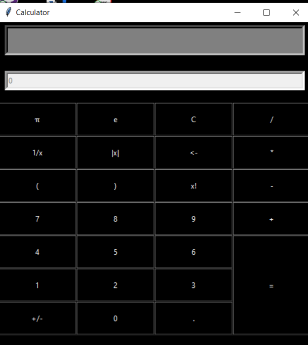

# Calculator
A calculator using python with the GUI being created using Python's tkinter library. Some of the main features of this calculator:
- Error handling has been taken into account while creating this calculator.
- Input can be given using both keyboard and mouse.
- Accuracy of the results has been kept as high as possible.

